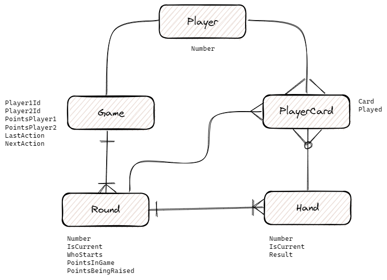

# 🐍 pytruco ♣️ ♥️ ♠️ ♦️

A REST API 2 player `truco` game implementation. It's still under development.

## Details

It's written in python using:
- [django](https://www.djangoproject.com/)
- [django-rest-framework](https://www.django-rest-framework.org/)

### Entities

All the game data is saved in the database and was modeled as follows:



For more information take a look at [models.py](./pytruco/apps/core/models.py).

## Running

Start the app using docker

```shell
docker compose up
```

And then you can access http://localhost:8000/api/schema/swagger-ui/